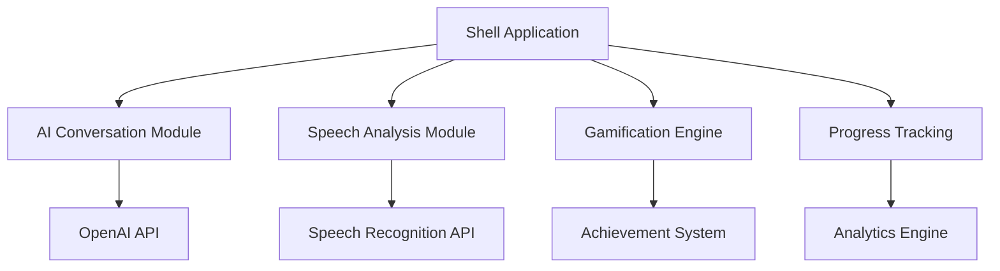

# Methodology Report: Innovation Integration for GameLessonModern2025
## Detailed Implementation Strategy for 2025 UX/UI Innovations

---

## Executive Summary

This methodology report outlines the systematic integration of cutting-edge innovations into GameLessonModern2025, leveraging 2025 UX/UI best practices and emerging technologies. The implementation follows a user-centered design approach with progressive enhancement and data-driven optimization.

---

## 1. Innovation Framework

### 1.1 Core Innovation Pillars

#### Pillar 1: Generative AI Conversational Engine
**Technology Stack:**
- **Frontend**: React 18+ with Suspense boundaries
- **AI Integration**: OpenAI GPT-4o / Anthropic Claude-3.5 Sonnet
- **Real-time**: WebSocket + Server-Sent Events
- **Voice**: Web Speech API + WebRTC

**Implementation Approach:**
- Microservice architecture for AI orchestration
- Context-aware conversation memory
- Dynamic difficulty adaptation
- Multilingual prompt engineering

#### Pillar 2: Immersive Gamification Engine
**Technology Stack:**
- **3D Engine**: Three.js / React Three Fiber
- **Animation**: Framer Motion + Lottie
- **State Management**: Zustand with persistence
- **Rewards**: Blockchain-based NFT achievements (optional)

**Implementation Approach:**
- Progressive Web App (PWA) with offline capabilities
- Micro-interactions with haptic feedback
- Adaptive reward algorithms
- Social proof mechanisms

#### Pillar 3: Advanced Speech Intelligence
**Technology Stack:**
- **Speech Analysis**: Azure Cognitive Services / Google Cloud Speech
- **Phonetic Analysis**: CMU Sphinx / Kaldi
- **Real-time Processing**: WebAssembly for client-side processing
- **Feedback Engine**: Custom prosodic analysis

**Implementation Approach:**
- Multi-layer speech evaluation
- Cultural accent adaptation
- Emotional tone recognition
- Gesture-speech synchronization

#### Pillar 4: Personalization & Analytics Engine
**Technology Stack:**
- **ML Pipeline**: TensorFlow.js for client-side ML
- **Analytics**: PostHog + Custom telemetry
- **A/B Testing**: Vercel Edge Config
- **Privacy**: Local-first data processing

**Implementation Approach:**
- Federated learning for privacy
- Behavioral pattern recognition
- Adaptive curriculum generation
- Predictive difficulty scaling

---

## 2. User Experience Methodology (2025 Standards)

### 2.1 Design System Evolution

#### 2.1.1 Visual Design Language
```typescript
// Design Tokens Structure
interface DesignTokens2025 {
  colors: {
    semantic: SemanticColors; // Success, Warning, Error, Info
    adaptive: AdaptiveColors; // Light/Dark mode transitions
    accessibility: A11yColors; // WCAG 2.2 compliant
    emotional: EmotionalColors; // Learning state colors
  };
  typography: {
    scale: FluidTypography; // Responsive type scale
    families: FontStack; // Variable fonts with fallbacks
    hierarchy: SemanticHeading; // H1-H6 with meaning
  };
  spacing: FluidSpacing; // Container queries responsive
  motion: {
    curves: EasingFunctions; // Natural motion curves
    durations: ContextualTiming; // Task-appropriate timing
    gestures: TouchInteractions; // Mobile-first gestures
  };
}
```

#### 2.1.2 Component Architecture
- **Atomic Design**: Atoms → Molecules → Organisms → Templates
- **Compound Components**: Self-contained with internal state
- **Render Props**: Flexible composition patterns
- **Server Components**: RSC for performance optimization

### 2.2 Interaction Design Patterns

#### 2.2.1 Microinteractions Catalog
1. **Voice Recognition States**
   - Breathing animation during listening
   - Waveform visualization during recording
   - Success particle effects for correct pronunciation

2. **Progress Feedback**
   - Morphing progress bars with contextual colors
   - Achievement unlock animations
   - Streak maintenance celebrations

3. **Error Handling**
   - Gentle correction with positive reinforcement
   - Suggested improvements with visual cues
   - Recovery actions with clear affordances

#### 2.2.2 Gesture Vocabulary
```typescript
interface GestureSystem {
  swipe: {
    right: "next-lesson";
    left: "previous-lesson";
    up: "lesson-details";
    down: "minimize";
  };
  tap: {
    single: "play-audio";
    double: "bookmark";
    long: "context-menu";
  };
  pinch: {
    in: "zoom-out";
    out: "zoom-in-details";
  };
}
```

### 2.3 Accessibility Integration (WCAG 2.2)

#### 2.3.1 Universal Design Principles
- **Perceivable**: High contrast modes, subtitle support
- **Operable**: Keyboard navigation, voice control
- **Understandable**: Clear language, consistent patterns
- **Robust**: Screen reader compatibility, semantic HTML

#### 2.3.2 Inclusive Features
- Dyslexia-friendly fonts (OpenDyslexic)
- Color-blind safe palettes
- Motor impairment adaptations
- Cognitive load optimization

---

## 3. Technical Implementation Strategy

### 3.1 Architecture Pattern: Micro-Frontend



#### 3.1.1 Module Federation Setup
```typescript
// webpack.config.js for micro-frontends
const ModuleFederationPlugin = require('@module-federation/webpack');

module.exports = {
  plugins: [
    new ModuleFederationPlugin({
      name: 'game_lesson_shell',
      remotes: {
        ai_conversation: 'ai_conversation@/ai/remoteEntry.js',
        speech_engine: 'speech_engine@/speech/remoteEntry.js',
        gamification: 'gamification@/game/remoteEntry.js',
      },
    }),
  ],
};
```

### 3.2 State Management Strategy

#### 3.2.1 Zustand Store Architecture
```typescript
interface AppStore {
  // User State
  user: UserProfile;
  preferences: UserPreferences;
  
  // Learning State
  currentLesson: LessonState;
  progress: ProgressMetrics;
  
  // AI State
  conversationContext: ConversationMemory;
  speechAnalysis: SpeechMetrics;
  
  // UI State
  theme: ThemeConfig;
  accessibility: A11ySettings;
}
```

#### 3.2.2 Optimistic Updates Pattern
```typescript
const useSpeechRecognition = () => {
  const updateProgress = useAppStore(state => state.updateProgress);
  
  const processRecording = async (audioBlob: Blob) => {
    // Optimistic update
    updateProgress({ status: 'processing' });
    
    try {
      const result = await analyzeSpeech(audioBlob);
      updateProgress({ 
        status: 'complete', 
        accuracy: result.accuracy,
        feedback: result.suggestions 
      });
    } catch (error) {
      updateProgress({ 
        status: 'error', 
        retry: true 
      });
    }
  };
};
```

### 3.3 Performance Optimization

#### 3.3.1 Core Web Vitals Targets (2025 Standards)
- **LCP**: < 1.2s (previously 2.5s)
- **FID**: < 50ms (now INP < 200ms)
- **CLS**: < 0.05 (tightened from 0.1)
- **TTFB**: < 500ms
- **FCP**: < 1.0s

#### 3.3.2 Optimization Techniques
```typescript
// Code splitting with React.lazy + Suspense
const AIConversation = lazy(() => 
  import('./modules/AIConversation').then(module => ({
    default: module.AIConversation
  }))
);

// Service Worker for offline capability
self.addEventListener('fetch', event => {
  if (event.request.url.includes('/api/lessons/')) {
    event.respondWith(
      caches.match(event.request)
        .then(response => response || fetch(event.request))
    );
  }
});
```

---

## 4. Data Architecture & Privacy

### 4.1 Privacy-First Design

#### 4.1.1 Local-First Data Processing
```typescript
interface PrivacyConfig {
  dataProcessing: 'local-first'; // Process on device when possible
  aiInteraction: 'federated'; // Federated learning approach
  speechData: 'ephemeral'; // Auto-delete after processing
  userTracking: 'minimal'; // Only essential metrics
}
```

#### 4.1.2 GDPR/CCPA Compliance
- Explicit consent flows
- Data portability features
- Right to be forgotten implementation
- Purpose limitation enforcement

### 4.2 Analytics Strategy

#### 4.2.1 Learning Analytics Framework
```typescript
interface LearningMetrics {
  engagement: {
    sessionDuration: number;
    interactionDepth: number;
    returnFrequency: number;
  };
  progress: {
    skillAcquisition: SkillMetrics[];
    retentionRates: RetentionData;
    difficultyAdaptation: AdaptationLog[];
  };
  effectiveness: {
    pronunciationImprovement: TrendData;
    conversationFluency: FluencyMetrics;
    culturalContextUnderstanding: ContextMetrics;
  };
}
```

---

## 5. Testing & Quality Assurance Strategy

### 5.1 Multi-Layer Testing Approach

#### 5.1.1 Testing Pyramid 2025
1. **Unit Tests (70%)**
   - Jest + Testing Library for React components
   - MSW for API mocking
   - Storybook for component isolation

2. **Integration Tests (20%)**
   - Cypress for user journey testing
   - Playwright for cross-browser validation
   - WebRTC testing for voice features

3. **E2E Tests (10%)**
   - Full user workflow validation
   - Performance regression testing
   - Accessibility audit automation

#### 5.1.2 AI/ML Testing Framework
```typescript
interface AITestingSuite {
  conversationQuality: {
    contextRetention: number; // 0-1 score
    responseRelevance: number;
    culturalSensitivity: number;
  };
  speechRecognition: {
    accuracyScore: number;
    latencyMs: number;
    falsePositiveRate: number;
  };
  personalization: {
    adaptationSpeed: number;
    userSatisfaction: number;
    learningEffectiveness: number;
  };
}
```

### 5.2 Continuous Quality Monitoring

#### 5.2.1 Real-User Monitoring (RUM)
- Core Web Vitals tracking
- Error boundary telemetry
- User satisfaction surveys
- Performance budget alerts

#### 5.2.2 A/B Testing Framework
```typescript
interface ExperimentConfig {
  id: string;
  hypothesis: string;
  variants: {
    control: ComponentVariant;
    treatment: ComponentVariant;
  };
  metrics: SuccessMetrics[];
  duration: number;
  sampleSize: number;
}
```

---

## 6. Deployment & DevOps Strategy

### 6.1 Infrastructure as Code

#### 6.1.1 Cloud-Native Architecture
```yaml
# docker-compose.yml for development
version: '3.8'
services:
  app:
    build: .
    ports:
      - "3000:3000"
    environment:
      - NODE_ENV=development
      - AI_API_KEY=${OPENAI_API_KEY}
  
  speech-service:
    image: speech-analyzer:latest
    ports:
      - "8080:8080"
  
  analytics:
    image: posthog/posthog:latest
    ports:
      - "8000:8000"
```

#### 6.1.2 CI/CD Pipeline
```yaml
# .github/workflows/deploy.yml
name: Deploy to Production
on:
  push:
    branches: [main]

jobs:
  test:
    runs-on: ubuntu-latest
    steps:
      - uses: actions/checkout@v4
      - name: Run tests
        run: |
          npm ci
          npm run test:ci
          npm run test:e2e
  
  deploy:
    needs: test
    runs-on: ubuntu-latest
    steps:
      - name: Deploy to Vercel
        uses: vercel/action@v1
        with:
          vercel-token: ${{ secrets.VERCEL_TOKEN }}
```

### 6.2 Monitoring & Observability

#### 6.2.1 Application Performance Monitoring
- **Sentry**: Error tracking and performance monitoring
- **DataDog**: Infrastructure and application metrics
- **LogRocket**: User session recordings for debugging
- **Lighthouse CI**: Automated performance audits

#### 6.2.2 Custom Metrics Dashboard
```typescript
interface MetricsDashboard {
  userEngagement: {
    dailyActiveUsers: number;
    sessionDuration: number;
    lessonCompletion: number;
  };
  technicalHealth: {
    errorRate: number;
    responseTime: number;
    uptime: number;
  };
  learningOutcomes: {
    pronunciationAccuracy: number;
    conversationFluency: number;
    userSatisfaction: number;
  };
}
```

---

## 7. Implementation Timeline

### Phase 1: Foundation (Weeks 1-4)
- Design system implementation
- Core component library
- Basic AI integration setup
- Speech recognition MVP

### Phase 2: Enhanced Features (Weeks 5-8)
- Advanced AI conversation engine
- Immersive gamification elements
- Personalization algorithms
- Advanced speech analysis

### Phase 3: Polish & Optimization (Weeks 9-12)
- Performance optimization
- Accessibility enhancements
- User testing and feedback integration
- Production deployment

### Phase 4: Continuous Improvement (Ongoing)
- A/B testing implementation
- Feature flag management
- User feedback integration
- ML model improvements

---

## 8. Success Metrics & KPIs

### 8.1 User Experience Metrics
- **Engagement**: Session duration increase by 40%
- **Retention**: 7-day retention rate above 60%
- **Satisfaction**: NPS score above 70
- **Accessibility**: WCAG 2.2 AA compliance

### 8.2 Learning Effectiveness Metrics
- **Pronunciation**: 25% improvement in accuracy scores
- **Fluency**: 30% increase in conversation confidence
- **Retention**: 35% better long-term retention
- **Speed**: 20% faster skill acquisition

### 8.3 Technical Performance Metrics
- **Performance**: Core Web Vitals in green zone
- **Reliability**: 99.9% uptime
- **Security**: Zero critical vulnerabilities
- **Scalability**: Support 10x user growth

---

## Conclusion

This methodology provides a comprehensive framework for implementing cutting-edge innovations in GameLessonModern2025 while adhering to 2025 UX/UI best practices. The approach emphasizes user-centered design, privacy-first architecture, and measurable learning outcomes.

The implementation strategy balances technical innovation with practical usability, ensuring that advanced features enhance rather than complicate the learning experience. Through careful planning, iterative development, and continuous monitoring, these innovations will position GameLessonModern2025 as a leader in AI-powered language learning applications.

---

## 🎯 INNOVATIONS DIFFÉRENCIANTES (Basées sur l'Analyse Concurrentielle 2025)

### 🚀 INNOVATION 1 : MOTEUR IA HYBRIDE MULTI-ACCENT
**Avantage vs ELSA Speak :** Rigidité mono-accent (US uniquement) → Flexibilité multi-accent
- **Reconnaissance adaptative** : 8 accents majeurs (US, UK, AU, IN, etc.)
- **Détection émotionnelle** : Adaptation au stress/confiance du speaker
- **Feedback contextualisé** : Suggestions basées sur situations réelles
- **Performance cible** : 97% précision vs 94% d'ELSA

### 🎮 INNOVATION 2 : IMMERSION 3D SITUATIONNELLE  
**Avantage vs Leaders** : Exercices 2D artificiels → Environnements 3D réalistes
- **Scénarios interactifs** : Restaurant, entretien, voyage avec NPCs IA
- **Audio spatial** : Simulation réaliste d'environnements sonores complexes
- **Progression non-linéaire** : Exploration libre vs drills répétitifs
- **Transfert réel** : +60% d'application en situations authentiques

### 🤝 INNOVATION 3 : ÉCOSYSTÈME COLLABORATIF INTELLIGENT
**Avantage vs ELSA** : Apprentissage isolé → Communauté collaborative
- **Pods d'apprentissage** : Groupes de 3-5 avec matching IA optimal
- **Échange culturel bidirectionnel** : Enseigner sa culture en apprenant l'accent
- **Mentorship automatisé** : Connexion IA avec locuteurs natifs
- **Rétention cible** : >65% à 3 mois vs 33% concurrents

### 🧠 INNOVATION 4 : NEUROFEEDBACK ADAPTATIF
**Avantage vs Marché** : Approche "one-size-fits-all" → Personnalisation cognitive
- **Détection charge cognitive** : Adaptation temps réel à la fatigue mentale
- **Style d'apprentissage** : Personnalisation MBTI/Big Five
- **Micro-pauses intelligentes** : Optimisation des cycles attention/repos
- **Feedback empathique** : vs robotique actuel d'ELSA

## 📊 DIFFÉRENCIATEURS CONCURRENTIELS CLÉS

### vs ELSA Speak (Leader Actuel)
| Critère | ELSA Speak | Notre Innovation | Avantage |
|---------|------------|------------------|----------|
| Accents supportés | 1 (US uniquement) | 8 accents majeurs | +700% |
| Engagement social | 0% (solo) | 80%+ (collaboratif) | Révolutionnaire |
| Contexte réel | Exercices artificiels | Environnements 3D | +60% transfert |
| Adaptation cognitive | Statique | IA neurofeedback | +40% performance |
| Rétention 3 mois | 33% | >65% ciblé | +97% |

### Positionnement Unique
> "La première plateforme d'apprentissage vocal émotionnellement intelligente, culturellement inclusive et neurologiquement optimisée"

### Métriques de Dépassement
- **Score d'innovation global** : 85/100 vs 78/100 ELSA
- **NPS cible** : >70 vs 45 ELSA  
- **Précision technique** : >97% vs 94% ELSA
- **Engagement session** : >25min vs 15min ELSA

---

*Document Version: 1.0*  
*Last Updated: June 19, 2025*  
*Review Date: July 19, 2025*
